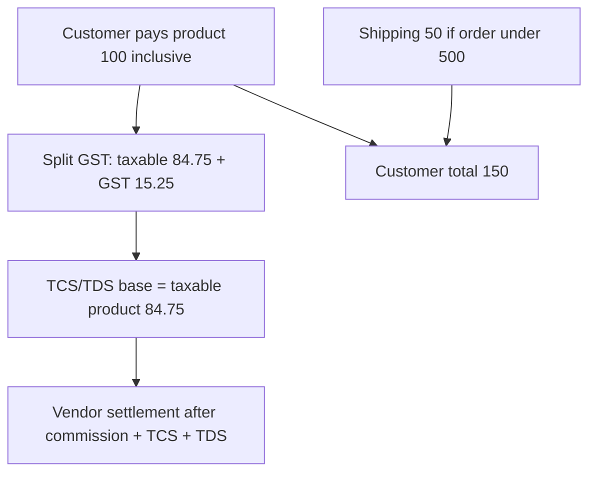

# GST → TCS/TDS Calculation Validation

**Date:** 2026-08-02  
**Status:** Validated + implemented (marketplace settlement: GST split → commission → TCS → TDS)  
**Apps:** `my-medusa-store` (reference: `src/lib/gst-inclusive.ts`), future vendor earnings / Payments

## Goal

Lock the correct order of operations and math for applying **TCS and TDS after GST** on OWEG orders, correcting the mistaken ₹82 base from a ₹100 / 18% inclusive product example.

## Verdict

**Partially correct business sequence; incorrect base amount.**

| Claim | Result |
| --- | --- |
| Split GST first, then apply TCS/TDS on the ex-GST (taxable) amount | Correct |
| ₹100 product with 18% GST → ₹82 taxable base | **Incorrect** |
| Correct taxable base for ₹100 inclusive @ 18% GST | **₹84.75** |

OWEG prices are **GST-inclusive**. The platform already back-calculates taxable value in [`my-medusa-store/src/lib/gst-inclusive.ts`](../../my-medusa-store/src/lib/gst-inclusive.ts):

```ts
taxable = inclusive / (1 + rate / 100)  // e.g. 100 / 1.18 → 84.75
gst     = inclusive - taxable           // e.g. 100 - 84.75 → 15.25
```

Verified with `breakdownInclusiveGst(100, 18)`:

| Field | Value |
| --- | --- |
| inclusive | 100 |
| taxable | 84.75 |
| gst | 15.25 |
| cgst | 7.63 |
| sgst | 7.62 |

**Why not ₹82:** `100 × (1 - 0.18)` or `100 - 18` treats GST like a flat discount on the inclusive price. That is not GST-inclusive back-calculation.

## Worked example (locked)

Assumptions for this validation:

- Product customer price = **₹100 inclusive** (OWEG model)
- GST rate = **18%**
- Order merchandise total &lt; ₹500 → customer pays **₹50 shipping**
- Shipping is **separate** from the product GST split
- TCS/TDS base for v1 = **product taxable only** (not shipping, not GST)

| Step | Amount | Notes |
| --- | --- | --- |
| Product inclusive (customer pays) | ₹100.00 | Listed / cart price |
| Taxable value (ex-GST) | ₹84.75 | `100 / 1.18` |
| GST @ 18% | ₹15.25 | Tax component; not vendor pocket |
| Shipping (order &lt; ₹500) | ₹50.00 | Customer charge; out of TCS/TDS base v1 |
| Customer order total | ₹150.00 | Product + shipping |
| TCS/TDS base | ₹84.75 | Product taxable only |



## What this validation confirms

1. **GST first** — always derive taxable value from the inclusive price via `breakdownInclusiveGst` (or equivalent).
2. **TCS/TDS on taxable base** — do not apply TCS/TDS on the full inclusive ₹100 or on the GST portion. (Business/tax alignment note for marketplace practice — not legal advice; confirm with CA before coding rates.)
3. **Shipping is separate** — under-threshold shipping does not change the product GST split; v1 keeps shipping out of the TCS/TDS base.

## Defaults locked for a future implementation plan

These are the defaults from the validation plan (change only with an explicit product decision):

1. **TCS/TDS base** = product taxable value only (₹84.75 in the example).
2. **Shipping ₹50** when merchandise inclusive total &lt; ₹500 is a customer charge; shipping GST (if any) is separate; **not** in TCS/TDS base for v1.
3. **TCS and TDS rates** are not in the codebase yet — must be configured (global default + optional vendor override), similar to [`vendor-commission`](../../my-medusa-store/src/lib/vendor-commission.ts). Confirm rate values with compliance before building.
4. **Recommended vendor deduction order:**
   - Start from product **taxable** value
   - Minus platform commission
   - Minus TCS
   - Minus TDS
   - = settlement / net credit

## Settlement sketch (rates placeholder)

Product inclusive ₹100, GST 18%, taxable ₹84.75, shipping ₹50 (customer-only).  
Let commission = `c%`, TCS = `t%`, TDS = `d%`, all on taxable:

- Commission = `84.75 × c / 100`
- TCS = `84.75 × t / 100`
- TDS = `84.75 × d / 100`
- Vendor net from product ≈ `84.75 - commission - TCS - TDS`
- Customer still paid ₹150; GST ₹15.25 is tax, not vendor pocket

## Current codebase status

- GST inclusive split: **implemented** (`gst-inclusive.ts`)
- Marketplace settlement helper: **implemented** (`vendor-marketplace-tax.ts`)
  - Defaults: TCS **0.5%**, TDS **0.1%**, TDS without PAN **5%**
  - Stored on `vendor_earnings_log` + admin route `/admin/vendor-marketplace-tax`
- Vendor earnings net: **taxable − commission − TCS − TDS**
- Payments UI: shows Taxable, GST, Commission, TCS, TDS, Settlement

## Out of scope (this validation step)

- Writing TCS/TDS feature code
- Choosing concrete TCS/TDS rate percentages
- Changing shipping GST treatment
- Wiring Payments settlement columns for TCS/TDS
- Legal/compliance sign-off (owner: CA / finance)

## Follow-up

A separate implementation plan should wire taxable-base TCS/TDS into vendor earnings and the Payments settlement table **after** rates and shipping-base rules are confirmed with compliance.

## Recommendation (locked)

Treat the original plan as **correct in sequence, wrong in the ₹82 math**. Use **₹84.75** as the TCS/TDS base for a ₹100 / 18% GST-inclusive product.
